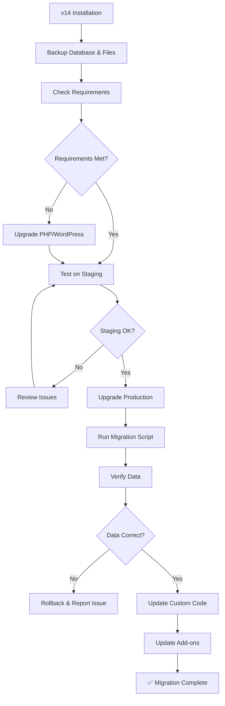

# Migration Overview

Guide for migrating to WP Statistics v15 from previous versions.

## Quick Links

- **[v14 to v15 Migration Guide](v14-to-v15-guide.md)** - Complete upgrade guide ⭐ **Start here**
- [Breaking Changes](breaking-changes.md) - List of breaking changes
- [Database Migration](database-migration.md) - Database schema changes
- [API Changes](api-changes.md) - API compatibility guide

## Should You Upgrade?

### ✅ Upgrade If You Want:
- Modern, fast React-based dashboard
- Improved performance and caching
- Advanced filtering and date range selection
- Better data visualizations
- New Analytics Query API
- Improved mobile experience
- Active development and support

### ⚠️ Consider Carefully If:
- You have custom code using deprecated APIs
- You're using unsupported add-ons
- You have a very large database (> 100M records)
- You cannot backup your database
- You're on shared hosting with strict limits

## Migration Process



## Requirements

### Minimum Requirements
- **PHP:** 7.4 or higher (8.0+ recommended)
- **WordPress:** 5.8 or higher (6.0+ recommended)
- **MySQL:** 5.6 or higher (5.7+ recommended)
- **Memory:** 256MB PHP memory limit minimum
- **Disk Space:** 50MB free for plugin + temp space for migration

### Recommended Environment
- **PHP:** 8.1+
- **WordPress:** 6.4+
- **MySQL:** 8.0+
- **Memory:** 512MB PHP memory limit
- **Object Cache:** Redis or Memcached
- **HTTPS:** SSL certificate installed

## Estimated Downtime

Migration time depends on your database size:

| Records | Estimated Time | Downtime |
|---------|----------------|----------|
| < 100K | 1-2 minutes | ~5 minutes |
| 100K - 1M | 5-10 minutes | ~15 minutes |
| 1M - 10M | 15-30 minutes | ~45 minutes |
| 10M+ | 1-2 hours | Schedule maintenance window |

**Tip:** Use a maintenance page plugin during migration.

## Pre-Migration Checklist

Before starting migration:

- [ ] **Backup database** (full backup, not just WP Statistics tables)
- [ ] **Backup plugin files** (entire wp-content/plugins/wp-statistics folder)
- [ ] **Test on staging environment** (if possible)
- [ ] **Check PHP version** (`php -v` or check phpinfo())
- [ ] **Check WordPress version** (Dashboard → Updates)
- [ ] **Review active add-ons** (check compatibility)
- [ ] **Document custom code** (any custom integrations)
- [ ] **Check disk space** (ensure adequate free space)
- [ ] **Note your settings** (screenshot important settings)
- [ ] **Disable caching** (temporarily disable caching plugins)
- [ ] **Schedule maintenance window** (for large sites)

## Migration Paths

### From v14.x → v15

**Status:** ✅ Fully Supported

Follow the [v14 to v15 Migration Guide](v14-to-v15-guide.md).

**What's Included:**
- Automatic database schema updates
- Data preservation (all historical data maintained)
- Settings migration
- Add-on compatibility checks

### From v13.x → v15

**Status:** ⚠️ Upgrade to v14 first

**Recommended Path:**
1. Upgrade v13 → v14 (follow v14 upgrade guide)
2. Wait 24 hours, verify data integrity
3. Upgrade v14 → v15 (follow this guide)

### From v12.x or older → v15

**Status:** ⚠️ Multi-step migration required

**Recommended Path:**
1. Upgrade to v13
2. Upgrade to v14
3. Finally upgrade to v15

**Alternative:** Fresh install (if historical data not critical)

## What Gets Migrated

### ✅ Automatically Migrated
- All visitor data
- All visit/session data
- All page view data
- Historical statistics
- Geographic data
- Search terms
- Referrers
- Plugin settings
- Exclusion rules
- GeoIP database

### ⚠️ Requires Manual Action
- Custom dashboard widgets (need updating)
- Custom report integrations (API changes)
- Custom tracking code (if using deprecated functions)
- Third-party theme integrations

### ❌ Not Migrated
- Old cache files (will be regenerated)
- Deprecated settings (removed features)
- Incompatible add-ons (need updates)

## Rollback Plan

If migration fails or causes issues:

1. **Immediate Rollback:**
   ```bash
   # Deactivate v15
   wp plugin deactivate wp-statistics

   # Restore database backup
   wp db import backup-before-v15.sql

   # Restore plugin files
   rm -rf wp-content/plugins/wp-statistics
   cp -r wp-statistics-v14-backup wp-content/plugins/wp-statistics

   # Activate v14
   wp plugin activate wp-statistics
   ```

2. **Report Issues:**
   - GitHub: https://github.com/wp-statistics/wp-statistics/issues
   - Forum: https://wordpress.org/support/plugin/wp-statistics/

## Post-Migration Tasks

After successful migration:

- [ ] Verify historical data accuracy
- [ ] Test all reports
- [ ] Check filter functionality
- [ ] Update custom code (if any)
- [ ] Update add-ons to v15-compatible versions
- [ ] Re-enable caching plugins
- [ ] Train team on new interface
- [ ] Review new features
- [ ] Optimize database (Settings → Tools → Optimize)
- [ ] Set up automated backups

## Support Resources

### Documentation
- [v14 to v15 Guide](v14-to-v15-guide.md) - Complete upgrade walkthrough
- [Breaking Changes](breaking-changes.md) - What changed
- [API Changes](api-changes.md) - Developer reference
- [Troubleshooting](../troubleshooting/common-errors.md) - Common issues

### Community Support
- **Forum:** https://wordpress.org/support/plugin/wp-statistics/
- **GitHub:** https://github.com/wp-statistics/wp-statistics
- **Documentation:** https://wp-statistics.com/docs/

### Professional Support
- **Priority Support:** Available with premium add-ons
- **Migration Assistance:** Contact sales for enterprise migrations
- **Custom Development:** Available for complex integrations

## Frequently Asked Questions

### Will I lose my historical data?
**No.** All data is preserved during migration. The migration script updates the database schema while keeping all historical records.

### How long does migration take?
**It depends** on database size. Small sites (< 100K records) migrate in minutes. Large sites (10M+ records) may take hours. See [Estimated Downtime](#estimated-downtime).

### Can I test migration safely?
**Yes.** Always test on a staging site first. Use backup/restore to try migration multiple times if needed.

### What if migration fails?
**Rollback.** Restore your database backup and plugin files. The site reverts to v14 state. No data is lost if you have backups.

### Do I need to update add-ons?
**Yes.** Check add-on compatibility before upgrading. Update add-ons to v15-compatible versions.

### Will my custom code break?
**Possibly.** Review [Breaking Changes](breaking-changes.md) and [API Changes](api-changes.md). Test thoroughly on staging.

---

**Ready to migrate?** Start with the [v14 to v15 Migration Guide](v14-to-v15-guide.md) →

*Last Updated: 2024-12-17*
